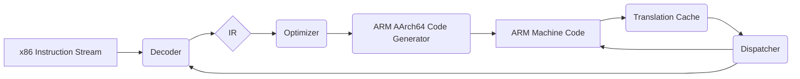

# XenoARM JIT Architecture

## Introduction

This document provides a detailed description of the XenoARM JIT (Just-In-Time) compiler's architecture. The JIT's primary role is to translate Original Xbox CPU (x86 IA-32) instructions into native ARM AArch64 machine code at runtime, enabling emulation of the Xbox CPU on ARM-based devices.

## High-Level Design

The JIT is composed of several core components that work together in a pipeline to decode, analyze, optimize, and translate x86 code blocks.

### Core Components

*   **Decoder:** Responsible for parsing the incoming x86 instruction stream and identifying individual instructions and their operands.
*   **Intermediate Representation (IR):** A lightweight, platform-agnostic representation of the decoded x86 instructions. This facilitates analysis and optimization before ARM code generation.
*   **Optimizer:** Performs basic optimization passes on the IR or during translation. Examples include constant folding, dead code elimination at a block level, and register allocation for ARM.
*   **ARM AArch64 Code Generator:** Translates the (potentially optimized) IR into equivalent ARMv8-A/ARMv9-A (AArch64) machine code sequences, leveraging NEON SIMD for x86 SSE/MMX instructions.
*   **Translation Cache (TC):** Stores blocks of already translated ARM code. When the JIT encounters an x86 code block it has seen before, it can fetch the translated ARM code directly from the TC, avoiding the overhead of re-translation.
*   **Dispatcher:** Manages the flow of execution. It determines whether to execute code from the Translation Cache, enter the JIT to compile a new block, or fall back to an interpreter (if available).
*   **Self-Modifying Code (SMC) Handling:** Implements strategies to detect when guest code modifies itself and invalidates corresponding entries in the Translation Cache to ensure correctness.
*   **Memory Management Interface:** Provides a clear interface for the JIT to read from and write to guest memory. The actual MMU/memory map implementation is external to the JIT core but must be accessible.

### JIT Pipeline Diagram

## Target CPU Emulation Details (Original Xbox)

*   **Architecture:** IA-32 (Intel P6 microarchitecture family, specifically Coppermine derivative).
*   **Instruction Sets:**
    *   General IA-32 integer instructions.
    *   MMX.
    *   SSE (Streaming SIMD Extensions). Note: No SSE2, SSE3, etc. on the Original Xbox.
    *   x87 FPU (minimal support for compatibility).
*   **Memory Model:** Segmented model (though typically flat on Xbox), paging. The JIT will need to interact with an MMU abstraction.
*   **Interrupts/Exceptions:** The JIT needs to detect conditions that would raise exceptions and delegate handling to the parent emulator.

## Target ARM Architecture Details (AArch64)

*   **ISA:** ARMv8-A / ARMv9-A (AArch64).
*   **Key Features to Leverage:**
    *   Ample general-purpose registers (X0-X30, W0-W30).
    *   NEON SIMD for SSE/MMX emulation.
    *   Conditional execution capabilities.
    *   Memory ordering and synchronization primitives.
    *   Efficient instruction scheduling for ARM pipelines.

## JIT Design Principles

*   **Modularity:** Separate components for decoding, IR, optimization, and code generation.
*   **Speed vs. Accuracy:** Prioritize accuracy first, then optimize for speed.
*   **Code Cache Management:** Efficient lookup, eviction policies (e.g., LRU if necessary), and patching for SMC.
*   **Register Allocation:** A key challenge. Mapping x86 registers (few, specialized) to ARM registers (many, general-purpose).
*   **Flags Handling:** x86 flags are set by many instructions. Efficiently emulating these on ARM is crucial. ARM condition flags can be leveraged but direct mapping isn't always possible.
*   **Error Reporting:** Detailed error logging and reporting for JIT translation failures or unexpected behavior.
*   **Testing & Validation:** Integration with open-source and custom x86 test suites for correctness.
*   **Profiling:** Continuous performance profiling to identify and optimize bottlenecks on target hardware (e.g., Flip 2).

## Key Technical Challenges

*   **SSE Emulation:** Mapping SSE instructions and registers (XMM0-XMM7) to ARM NEON registers (V0-V31). Ensuring correct handling of packed data types, rounding modes, and exceptions.
*   **x86 Flags Emulation:** The x86 EFLAGS register is complex. Many x86 instructions implicitly modify multiple flags. This often requires explicit flag calculation sequences in ARM code.
*   **Self-Modifying Code (SMC):** Requires careful write-protection of JITted code pages and invalidation/recompilation when writes are detected.
*   **Memory Ordering:** x86 has a stronger memory consistency model (TSO - Total Store Order) than ARM's typically weaker model. Appropriate memory barriers (e.g., DMB) might be needed in generated ARM code.
*   **Floating Point Precision:** Achieving bit-perfect floating-point results can be challenging, especially for x87 FPU instructions. Aim for "good enough" for games initially.
*   **Performance Bottlenecks:** Identifying and optimizing frequently translated or executed paths. Overhead of JIT entry/exit and block chaining.
*   **ARM Linux Security:** Ensure the JIT can allocate and execute memory pages (mprotect/PROT_EXEC) on the target Linux OS.